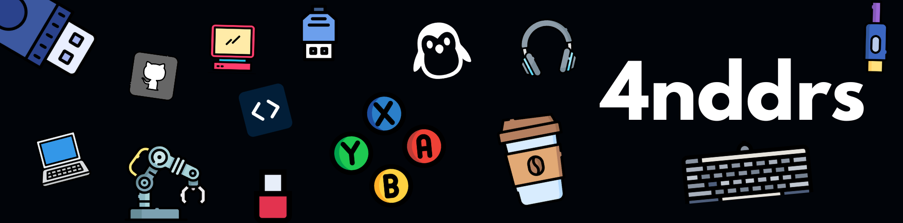

  

<h1 align="center" style="font-weight: bold; margin-bottom: 0.2em;">
  Hey, I'm <a href="https://4nddrs.netlify.app/" target="_blank" style="color:#4AB3F4; text-decoration:none;">Andrés</a>
</h1>

  

<h2 align="left" style="color:#8AB4F8;">🧠 About Me</h2>

<ul style="max-width: 500px; margin: 0 auto; list-style: none; padding-left: 0; font-size: 1.1rem; line-height: 1.6; color: #cbd5e1;">
  <li>🎓 Junior in <b>Systems Engineering</b> @Univalle</li>
  <li>🔐 Passionate about <b>cybersecurity</b>, <b>Linux</b>, and the <b>command line</b></li>
  <li>🐍 Python programmer, curious about automation</li>
  <li>🎮 Exploring game development with <b>Unity</b></li>
  <li>🛠️ Minimalist, terminal-lover, obsessed with efficiency</li>
  <li>🌍 Visit my website: <a href="https://4nddrs.netlify.app" target="_blank" style="color:#4AB3F4; text-decoration:none;">4nddrs.netlify.app</a></li>
</ul>

## 🧰 Tech Toolbox

<table align="center" width="100%" cellpadding="10">
  <tr>
    <td width="50%" valign="top" align="center">
      <h3>💻 Languages</h3>
      

        
      

    </td>
    <td width="50%" valign="top" align="center">
      <h3>🧱 Frameworks & Libraries</h3>
      

        
      

    </td>
  </tr>
  <tr>
    <td width="50%" valign="top" align="center">
      <h3>🗄️ Databases</h3>
      

        
      

    </td>
    <td width="50%" valign="top" align="center">
      <h3>🔧 Dev Tools</h3>
      

        
      

    </td>
  </tr>
  <tr>
    <td width="50%" valign="top" align="center">
      <h3>🎨 Design & Productivity</h3>
      

        
      

    </td>
    <td width="50%" valign="top" align="center">
      <h3>🧑‍💻 IDEs</h3>
      

        
      

    </td>
  </tr>
  <tr>
    <td colspan="2" align="center">
      <h3>🖥️ Operating Systems</h3>
      

        
      

    </td>
  </tr>
  <tr>
    <td colspan="2" align="center">
      <h3>📚 Learning</h3>
      

        
      

    </td>
  </tr>
</table>

## 📊 GitHub Stats

